# Project 4: Advanced Lane Finding Project
  
The goals / steps of this project are the following:

* Compute the camera calibration matrix and distortion coefficients given a set of chessboard images.
* Apply a distortion correction to raw images.
* Use color transforms, gradients, etc., to create a thresholded binary image.
* Apply a perspective transform to rectify binary image ("birds-eye view").
* Detect lane pixels and fit to find the lane boundary.
* Determine the curvature of the lane and vehicle position with respect to center.
* Warp the detected lane boundaries back onto the original image.
* Output visual display of the lane boundaries and numerical estimation of lane curvature and vehicle position.


## [Rubric](https://review.udacity.com/#!/rubrics/571/view) Points
###Here I will consider the rubric points individually and describe how I addressed each point in my implementation.  

---
###Writeup / README

####1. Provide a Writeup / README that includes all the rubric points and how you addressed each one.  You can submit your writeup as markdown or pdf.  [Here](https://github.com/udacity/CarND-Advanced-Lane-Lines/blob/master/writeup_template.md) is a template writeup for this project you can use as a guide and a starting point.  

You're reading it!
###Camera Calibration

####1. Briefly state how you computed the camera matrix and distortion coefficients. Provide an example of a distortion corrected calibration image.

The code for this step is contained in the file called `camera_cali.py`).  

I start by preparing "object points", which will be the (x, y, z) coordinates of the chessboard corners in the world. Here I am assuming the chessboard is fixed on the (x, y) plane at z=0, such that the object points are the same for each calibration image.  Thus, `objp` is just a replicated array of coordinates, and `objpoints` will be appended with a copy of it every time I successfully detect all chessboard corners in a test image.  `imgpoints` will be appended with the (x, y) pixel position of each of the corners in the image plane with each successful chessboard detection.  

I then used the output `objpoints` and `imgpoints` to compute the camera calibration and distortion coefficients using the `cv2.calibrateCamera()` function.  I applied this distortion correction to the test image using the `cv2.undistort()` function and obtained this result: 

<p align="center">
    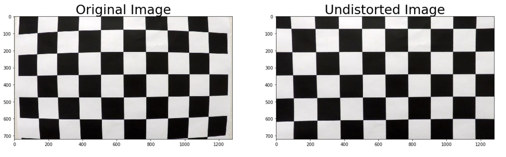
    <br>Undistorted Chess Image<br>
</p>

###Pipeline (single images)

####1. Provide an example of a distortion-corrected image.
To demonstrate this step, I will describe how I apply the distortion correction to one of the test images like this one:
<p align="center">
    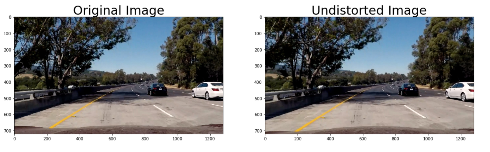
    <br>Undistorted Test Image<br>
</p>

####2. Describe how (and identify where in your code) you used color transforms, gradients or other methods to create a thresholded binary image.  Provide an example of a binary image result.

I first transformed the image from RGB space to HSV, and then used a yellow and white mask to pick out yellow and white lines respectively. (mask steps at lines #90 through #109 in `thresh.py`)

<p align="center">
    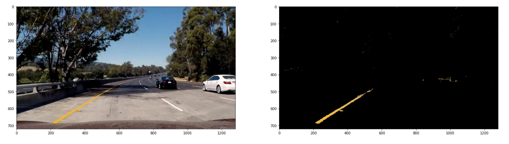
    <br>Yellow Mask<br>
</p>


<p align="center">
    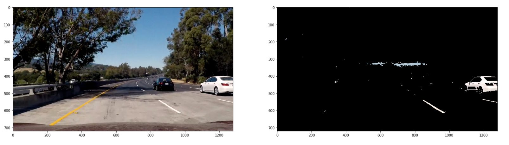
    <br>White Mask<br>
</p>

Then, combine these two masks to generate a binary image.
<p align="center">
    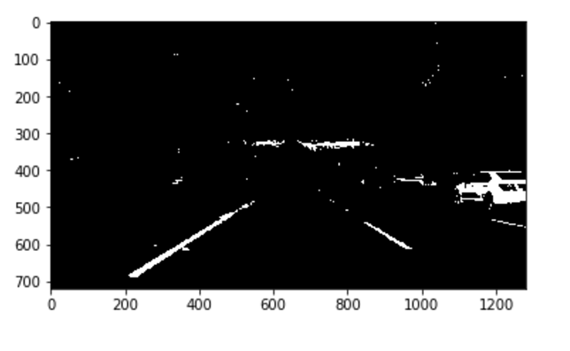
    <br>Combination of Yellow and White Mask<br>
</p>


For the optimal thresholding result, I combined the color mask with gradient magnitude and direction of the Sobel kernel to further filter out the noise in the image. I used the IPython widgets module to build an interactive interface to tune the thresholding parameters. Here's an example of my output for some of the test images.

<p align="center">
    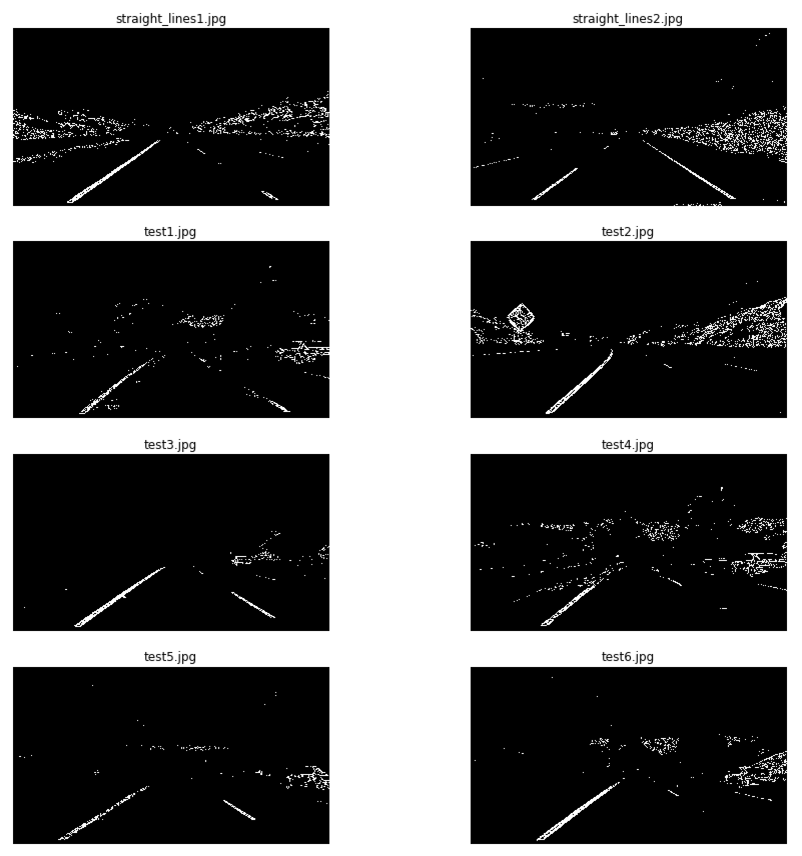
    <br>Combination of Color Mask and Gradient Thresholding<br>
</p>


####3. Describe how (and identify where in your code) you performed a perspective transform and provide an example of a transformed image.
(perspective transform steps at lines #20 through #38 in `pipeline.py`)

The `perspective_transform()` function takes as inputs an image (`img`), and inside the function, `cv2.getPerspectiveTransform()` takes the source and destination inputs and return the rotation matrix. I chose the hardcode the source and destination points in the following manner:

```
height = img_size[0] #720
width = img_size[1] #1280
top_left_x = width * 0.45 #576
top_right_x = width * 0.55 #704
top_y = height * 0.63 #453
dst_top_left_x = width * 0.25 # 320
dst_top_right_x = width * 0.75 # 960

src = np.float32([[top_left_x, top_y], [top_right_x, top_y],
                   [width, height], [0, height]])
dst = np.float32([[dst_top_left_x, 0], [dst_top_right_x, 0], 
                  [dst_top_right_x, height], [dst_top_left_x, height]])

```
This resulted in the following source and destination points:

| Source        | Destination   | 
|:-------------:|:-------------:| 
| 576, 453      | 320, 0        | 
| 704, 453      | 960, 0        |
| 1280,720      | 960, 720      |
| 0,720         | 320, 720      |


Once the rotation matrix is obtained, `cv2.warpPerspective()` will take it along with the input image and size of the image and return the warped image. I verified that my perspective transform was working as expected by drawing the `src` and `dst` points onto a test image and its warped counterpart to verify that the lines appear parallel in the warped image.

<p align="center">
    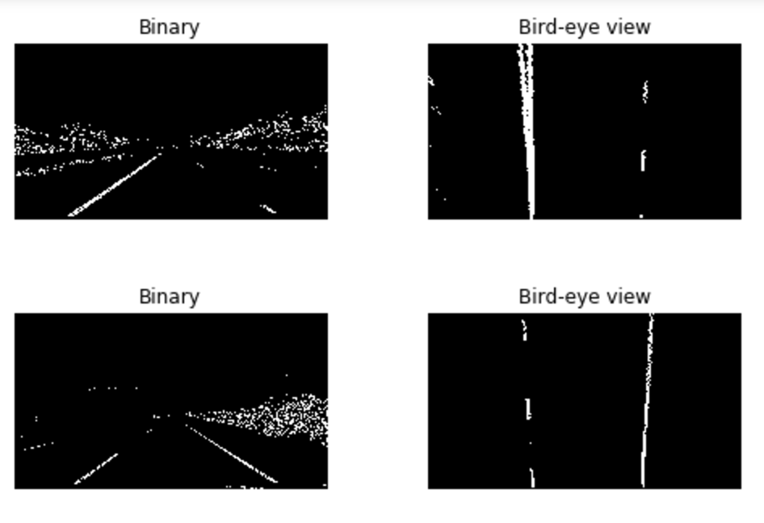
    <br>Binary Image vs. Bird-eye View<br>
</p>

####4. Describe how (and identify where in your code) you identified lane-line pixels and fit their positions with a polynomial?

The histogram of the perspective transformed image in lower half is plotted to identify the x position of left and right lanes. (histogram is found at lines #41 through #53 in `pipeline.py`)

<p align="center">
    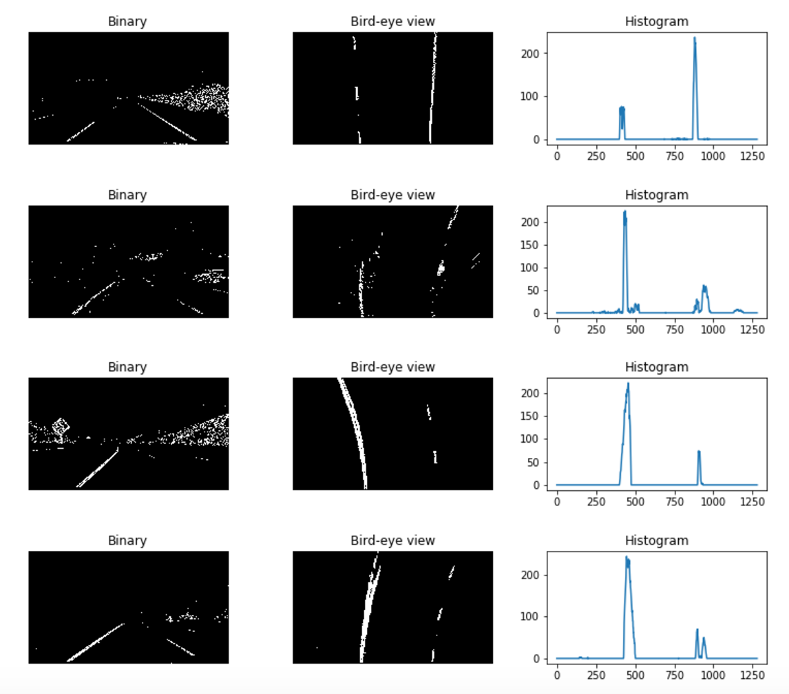
    <br>Binary Image vs. Bird-eye View vs. Histogram<br>
</p>

Once the initial position of left and right lanes are detected, 9 sliding windows are plotted to identify the lanes whose pixel values are greater than a threshold value (50 pixels). And 


<p align="center">
    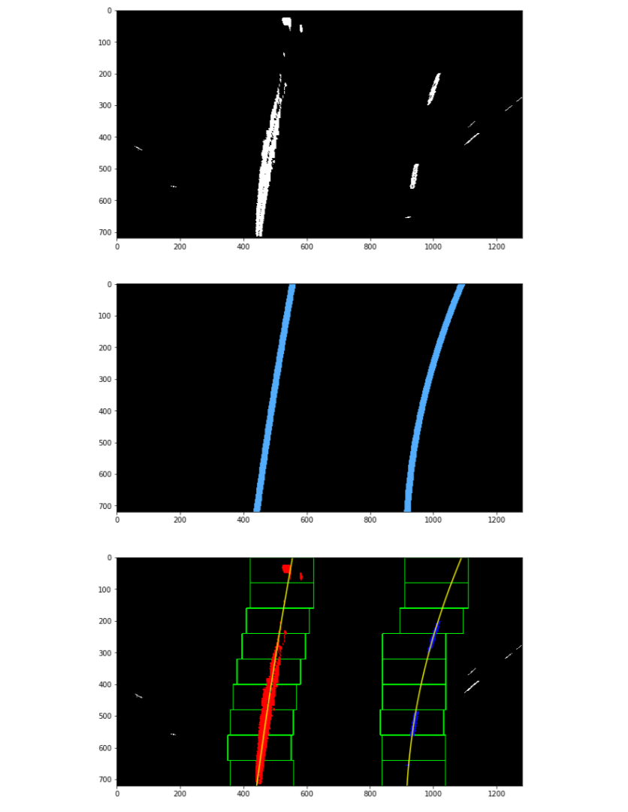
    <br>Line Polynomial Fitting<br>
</p>

####5. Describe how (and identify where in your code) you calculated the radius of curvature of the lane and the position of the vehicle with respect to center.

The curverature calculation is based on the formula shown below. The position of the vehicle is calculated as the difference between lane center and image center. (curverature calculation in lines #195 through #210 and offset from center calculation in lines #212 through #218 in `pipeline.py`.)

<p align="center">
    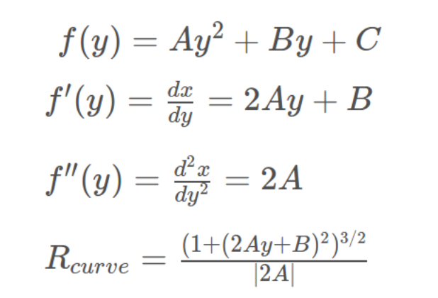
    <br>Curverature Calculation Formula<br>
</p>


####6. Provide an example image of your result plotted back down onto the road such that the lane area is identified clearly.

The left part is left for the result image, the top right section is the thresholding view, the middle right section contains the current line fitting in blue and smoothed line fitting over past 15 frames in light purple and the bottom right section shows the sliding window for lane line detection. I implemented the plotting step in lines #221 through #235 in my code in `pipeline.py` in the function `ad_lane_mask()`. Here is an example of my result on a test image:

<p align="center">
    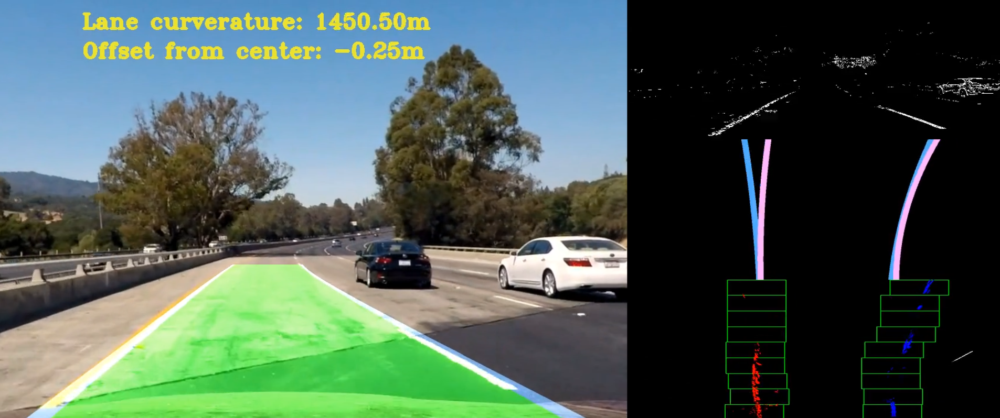
    <br>Lane Area Plot<br>
</p>

---

###Files

Here are the essential files needed for this proejct:

* main.py: main program to generate final video
* camera_cali.py: perform camera calibration and save the calibration file
* thresh.py: undistort images, color mask and gradient thresholding
* pipeline.py : perspective transform, line polyfit, curverature & offset center calculation and add line mask
* End-to-End Pipeline.ipynb: all functions in one file  

Use command `python main.py` or run `End-to-End Pipeline.ipynb` to generate the output video.


###Result

* Project video (Click to open video on Youtube)

<p align="center">
	<a href="https://youtu.be/K6zovhaC90w">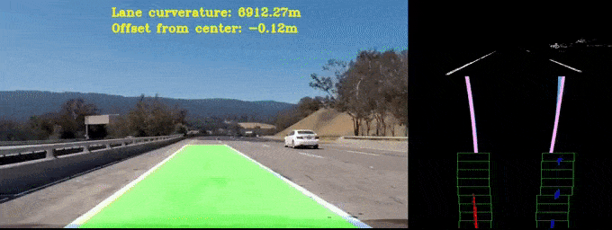</a>
</p>
---


###Discussion

####1. Briefly discuss any problems / issues you faced in your implementation of this project.  Where will your pipeline likely fail?  What could you do to make it more robust?

The whole project is implemented based on a traditional computer vision approach. The overall pipeline involves camera calibration, distortion correction, color and gradient thresholding, perspective transform and ploynomial lane fitting. Tuning all the thresholding parameter is crucial in this project, because the clearly detected lane lines are the fundamental element. Lots of efforts are put in the thresholding tuning, and fortunately, an interactive tool is used to expediate the tuning process.
My pipeline performs well on the proejct video, but not very robust on the challenge video. The pipleline does the line smoothing over the past 15 frames, but does not include the outlier removal feature. If an outlier line presents, the pipeline is very likely to break. In the near future, I would add the outlier removal feature in the pipeline to tackle the challenge video.
