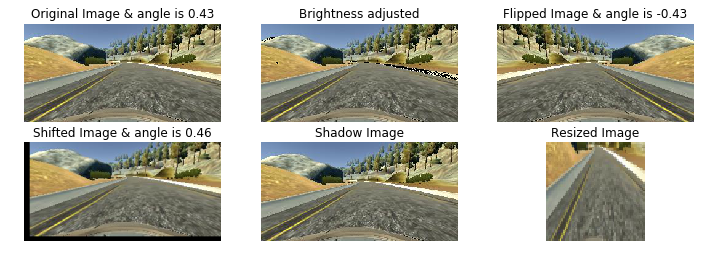

# Project 3: Behavior Cloning
  

    
     Driving autonomously on track 

  
## Overview
  
This is the 3rd project in Udacity Self-driving Car Engineer Nanodegree. The main goal of this project is to train a car using convolutional neural networks in Keras to drive autonomously in a simulator provided by Udacity. 
  
This paper from NVIDIA is recommended for reading before getting started on this project. This paper provides a end-to-end design approach to train the self-driving car using three on-board cameras.

[NVIDIA Paper: End to End Learning for Self-Driving Cars](http://images.nvidia.com/content/tegra/automotive/images/2016/solutions/pdf/end-to-end-dl-using-px.pdf)

## Simulator 

    
     Udacity beta simulator 

The simulator contains two modes, training mode and autonomous mode. The training mode is designed to allow players drive the car like it's a video game and collect training images and angle data. The autonomous mode is used to verify the final model.

Note: this is the old version simulator for macOS, provided by one classmate on Facebook group December 2016: Self-Driving Car Nanodegree. The second track in this version is doable.
  
[Nov version macOS](https://d17h27t6h515a5.cloudfront.net/topher/2016/November/5831f290_simulator-macos/simulator-macos.zip)  

Note: The following 3 versions are downloaded in Feb 2017, which are the latest by the time my project is submitted. The second track is also known as "Jungle Track", which is very challenging.

[Feb version macOS](https://d17h27t6h515a5.cloudfront.net/topher/2017/February/58983385_beta-simulator-mac/beta-simulator-mac.zip)

[Feb version Linux](https://d17h27t6h515a5.cloudfront.net/topher/2017/February/58983558_beta-simulator-linux/beta-simulator-linux.zip)

[Feb version Windows](https://d17h27t6h515a5.cloudfront.net/topher/2017/February/58983318_beta-simulator-windows/beta-simulator-windows.zip)

## Training Data

The training data for the first track is provided by Udacity.

[First Track Data](https://d17h27t6h515a5.cloudfront.net/topher/2016/December/584f6edd_data/data.zip) 
 
## Files

Here are the essential files needed for this proejct:

* drive.py: a Python script that you can use to drive the car autonomously, once your deep neural network model is trained 
* model.py: the end-to-end model
* model.json : saved training model  
* model.h5 : saved training weights  

Use command `python drive.py model.h5` to initiate the autonomous mode in the simulator.
 
 
## Data Exploration
  

    
     Training data histogram 

 
The histogram of the training data shows the distribution of the data is highly biased that majority of the data is nearly 0. To combat the biased data distribution, only the steering angles that are greater or equal to the threshold 0.002 and 300 samples lower than the threshold are randomly chosen and appended to the new array. The number of the dataset is not enough to train the convolutional neural network, thus data augumentation is needed.
 

    
     Preprocessed Training data histogram 

 

## Data Augumentation

To increase the number of training samples, besides the center image, the left and right images could be used. Concretly, an offset is added with respect to the steering angle associated with the center image to the left image, and subtracted to the right image. The reason is that when the car turns left, the angle needed for the left image becomes smaller and the angle needed for the right image becomes bigger. This would allow the model to learn how to steer if the car drifts off to the left or the right. The offset is set as 0.24, after trials and errors.
 

    
     Left, center and right images 

* Adjust Brightness
The brightness coefficient is randomly generated between [0.55, 1.25] to simulate the day and night situation on the track.

* Flip Horizontally
Out of 50% chance, the image is flipped horizontally and its corresponding angle reverses the sign, e.g, positive becomes negative and vice versa.

* Shift Horizontally and Vertically
The image could shift horizontally in range [-25, 25] pixels and veritically in range [-15, 15] pixels. The corresponding steering angle is changing 0.003 unit per pixel shift. 

* Add Shadow
The shadow shape is randomly generated to simulate the shadow effect in the fantastic graphic mode.

* Crop and Resize
The sky and the hood of the car is cropped and all the images are resize to 64 x 64 for training. This function is also included in the drive.py.

    
     Augumented images 

  
2000 sample images are generated from the data augumentation pipeline, and its distribution looks similar to that of the 2000 samples generated from a normal distribution with mean at 0 and standard deviation 0.3.

    
     Augumented training data histogram 

 

    
     Normal distribution 

 

## Network Architecture  
The model is implemented in Keras, the first layer is a lambda layer to normalize the image between range [-1, 1]. 4 convolutional layers are used, their depths are 32, 32, 64 and 128. The filter size are all 3 x 3. A 2 x 2 max pooling layer follows each convoluational layer, followed by a Relu activation layer. There are 3 fully connected layers after the 4th convolutional layer.Each layer is followed by a Relu activation layer and a dropout layer with 50% probability to combat overfitting.

20% of the training data are used as validation set.

    
     Overall convolutional neural network artchitecture 

 

## Hyperparameters
Adam optimzer is used to avoid manual learning rate adjustment. Learning rate is set as 0.0001. Batch size is set as 256 and number of samples per epoch is 20480. Epoch is set to 4, because the validation loss is small enough.
 
## Result
The validation loss reaches 0.0171 at the fourth epoch.

    
     Training result 

  
## Drive.py 
The crop and resize function is included and the maximum speed is set as 20, since the cpu of the computer is not enough to handle speed 30; otherwise the car would drive in a zig-zag fashion.
 

## How am I driving?
  
* Track1 in latest simulator (Click to open video on Youtube)
  
  
  
  
* Track2 in old simulator (Click to open video on Youtube)
  

   
## Reflection
This is a very cool project, I not only get practice on data augumentation, but also practice with keras, which is a neat and fast prototyping tool sitting on top of Tensorflow. The jungle track is really challenging, the current model would fail on the first turn. If I build a new high-end machine later on, I would retrain my model in fantastic mode for all 3 tracks.