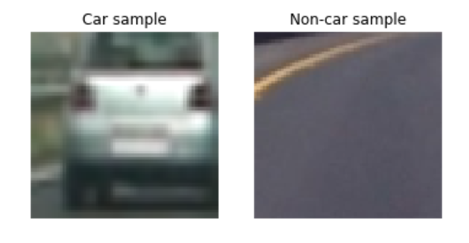
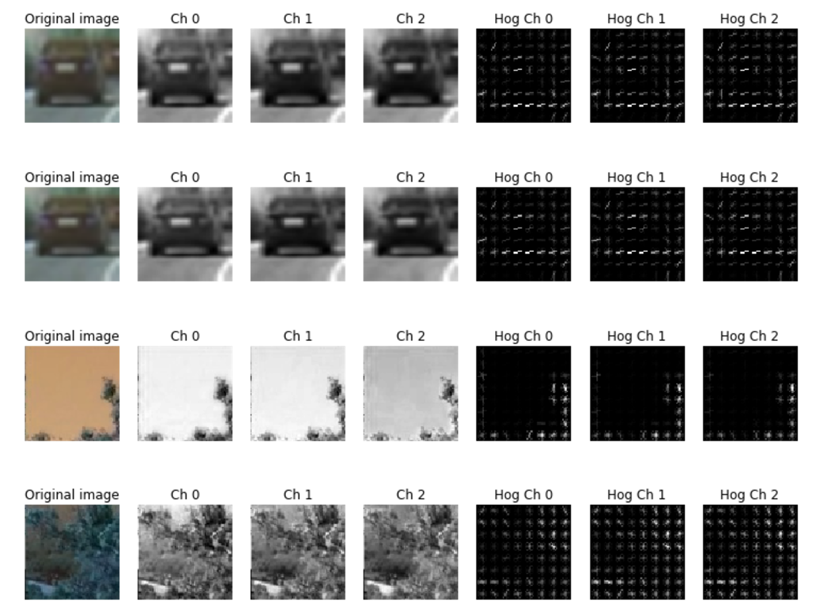
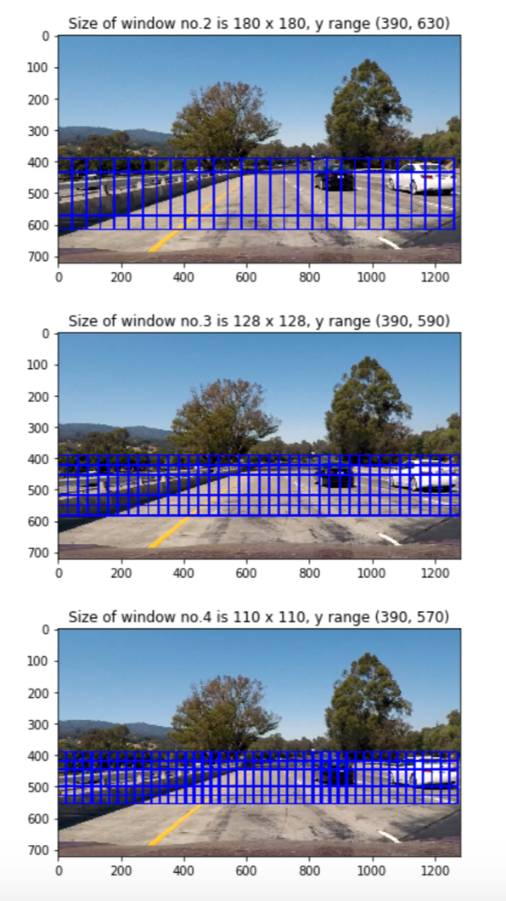
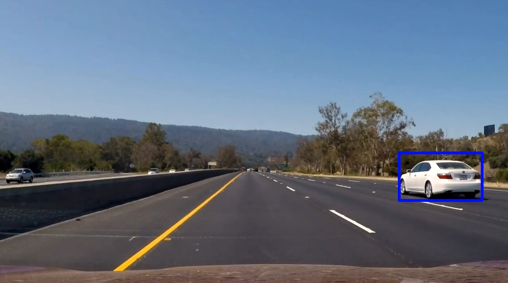
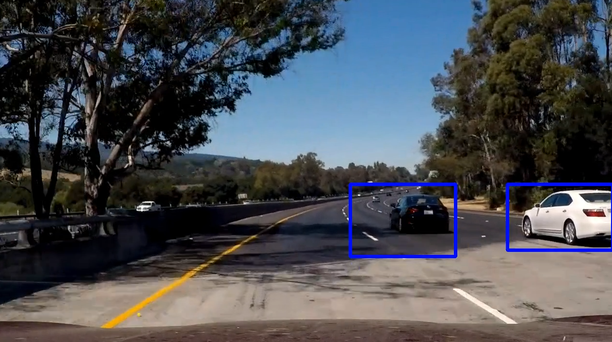
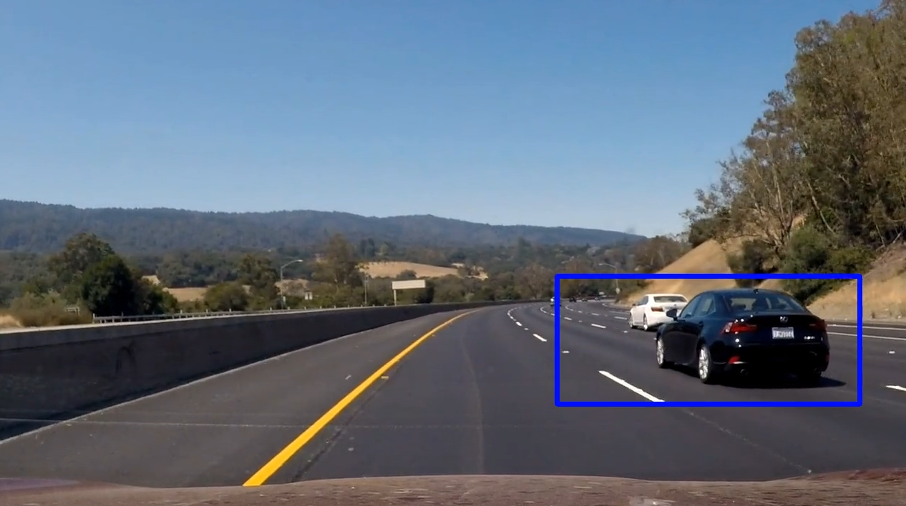
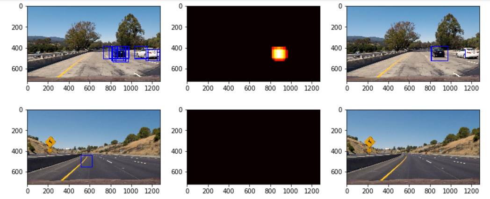
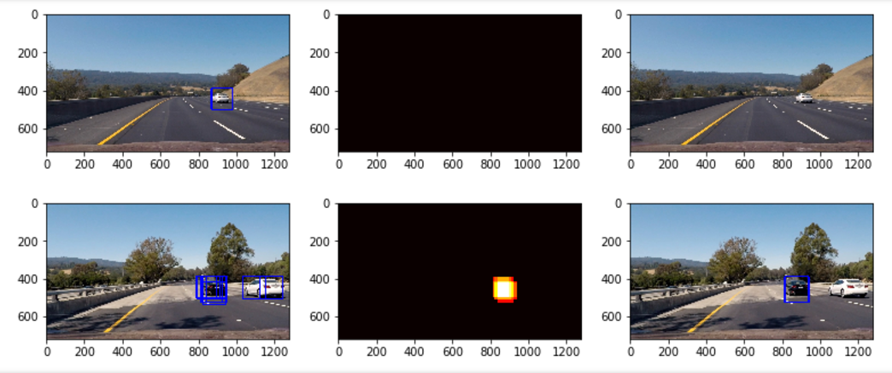
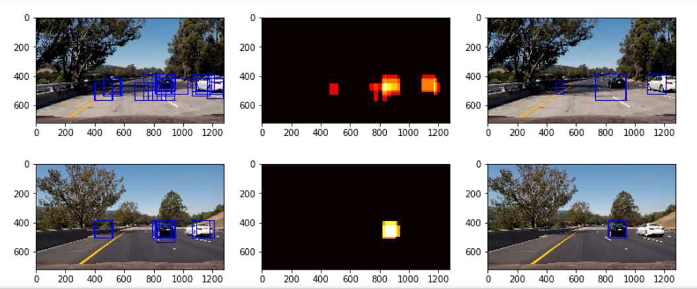

# Project 5: Vehicle Detection Project

The goals / steps of this project are the following:

* Perform a Histogram of Oriented Gradients (HOG) feature extraction on a labeled training set of images and train a classifier Linear SVM classifier
* Optionally, you can also apply a color transform and append binned color features, as well as histograms of color, to your HOG feature vector. 
* Note: for those first two steps don't forget to normalize your features and randomize a selection for training and testing.
* Implement a sliding-window technique and use your trained classifier to search for vehicles in images.
* Run your pipeline on a video stream (start with the test_video.mp4 and later implement on full project_video.mp4) and create a heat map of recurring detections frame by frame to reject outliers and follow detected vehicles.
* Estimate a bounding box for vehicles detected.

## [Rubric](https://review.udacity.com/#!/rubrics/513/view) Points
###Here I will consider the rubric points individually and describe how I addressed each point in my implementation.  

---
###Writeup / README

####1. Provide a Writeup / README that includes all the rubric points and how you addressed each one.  You can submit your writeup as markdown or pdf.  [Here](https://github.com/udacity/CarND-Vehicle-Detection/blob/master/writeup_template.md) is a template writeup for this project you can use as a guide and a starting point.  

You're reading it!

###Histogram of Oriented Gradients (HOG)

####1. Explain how (and identify where in your code) you extracted HOG features from the training images.

The code for this step is contained in the file `svm_train.py`.

I started by reading in the path directory for all the `vehicle` and `non-vehicle` images.  Here is an example of one of each of the `vehicle` and `non-vehicle` classes:

    
     Car and Non-car Sample 

I then explored different color spaces and different `skimage.hog()` parameters (`orientations`, `pixels_per_cell`, and `cells_per_block`).  I grabbed random images from each of the two classes and displayed them to get a feel for what the `skimage.hog()` output looks like.

Here is an example using the `HLS` color space and HOG parameters of `orientations=9`, `pixels_per_cell=(8, 8)` and `cells_per_block=(2, 2)`:

    
     HOG Image for 3 Channels 

####2. Explain how you settled on your final choice of HOG parameters.

I tried various combinations of parameters and settle with the parameters that  

####3. Describe how (and identify where in your code) you trained a classifier using your selected HOG features (and color features if you used them).

The training and testing dataset are provided by Udacity and they are splitted into 80% and 20% portion randomly for model training and testing. I trained a linear SVM using the following parameters and achieved 99.16% accuracy on test data. 

color_space = 'HLS' 

orient = 9 

pix_per_cell = 8 

cell_per_block = 2 

hog_channel = 'ALL' 

spatial_size = (16, 16) 

hist_bins = 32   

spatial_feat = True 

hist_feat = True 

hog_feat = True 

###Sliding Window Search

####1. Describe how (and identify where in your code) you implemented a sliding window search.  How did you decide what scales to search and how much to overlap windows?

I have plotted out different window sizes, 200 x 200, 180 x 180, 128 x 128, 110 x 110, 96 x 96, 80 x 80 and 64 x 64, and tried different combination of them to detect the vehicles while minimizing the false positive. I only searched the area staring at x = 300, and starting at y = 390. For larger window sizes, the y value is larger, since we are interested in detecting the cars closer to our position. I used 0.75 for all window search, since it gave relatively low false positive rate.

    
     Multiple Sliding Windows 

####2. Show some examples of test images to demonstrate how your pipeline is working.  What did you do to optimize the performance of your classifier?

Ultimately I searched on two scales, 120 x 120 and 110 x 110 using HLS 3-channel HOG features plus spatially binned color and histograms of color in the feature vector, which provided a nice result.  Here are some example images:

	
	
    
     Vehicle Detection Screenshots 

---
### Video Implementation

####1. Provide a link to your final video output.  Your pipeline should perform reasonably well on the entire project video (somewhat wobbly or unstable bounding boxes are ok as long as you are identifying the vehicles most of the time with minimal false positives.)

* Project video (Click to open video on Youtube)

	

####2. Describe how (and identify where in your code) you implemented some kind of filter for false positives and some method for combining overlapping bounding boxes.

I recorded the positions of positive detections in each frame of the video.  From the positive detections I created a heatmap and then thresholded that map to identify vehicle positions.  I then used `scipy.ndimage.measurements.label()` to identify individual blobs in the heatmap.  I then assumed each blob corresponded to a vehicle. I constructed bounding boxes to cover the area of each blob detected.  

Here's an example result showing the heatmap from a series of frames of video, the result of `scipy.ndimage.measurements.label()` and the bounding boxes then overlaid on the last frame of video:

### Here are six frames, their corresponding heatmaps and the resulting bounding boxes:

    
    
    
     Heatmap for Six Frames 

---
###Files

Here are the essential files needed for this proejct:

* feat_extract.py: functions for feature extraction
* slide_window.py: functions for sliding window and heatmap 
* svm_train.py: read in images and train svm model
* para_file.p : saved svm model and parameters file
* SVM_Testing.ipynb: load para_file.p and feat_extract.py
* Feature_Extraction_SVM_Training.ipynb: load feat_extract.py and svm_train.py
* Sliding_window.ipynb: all functions in one file  

Run `Sliding_window.ipynb` to generate the output video.

---
###Discussion

####1. Briefly discuss any problems / issues you faced in your implementation of this project.  Where will your pipeline likely fail?  What could you do to make it more robust?

I spent most the time on selecting combination of search windows to reduce the number of false positive. Initially I started with 3 search windows, 128 x 128, 96 x 96 and 64 x 64, but too many false positives existed in the video. Then I tried using only 1 or 2 search windows not only to reduce the false positive, but also the video processing time. Finally I found the combiantion of 120 x 120 and 110 x 110 search window with a heatmap averaged over the past 10 frames would give a decent result. Although there were several sudden false positives in the final video, the whole pipeline did a fairly good job detecting the vehicles. The pipeline was likely to detect guard rails as cars during 38 - 42s in the video, I increased the threshold for heatmap to reduce the false postive.

